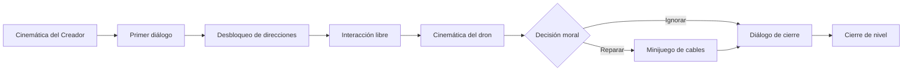

<div align="center">

# ¿Quién es Más Humano?

### Un videojuego narrativo 2D sobre ética, ciencia e inteligencia artificial

*Controla a **ANIMA-101**, una IA que aprende a moverse, a hablar y a decidir, mientras viaja al pasado para presenciar los dilemas morales de la ciencia.*


</div>

---

## Sobre el proyecto

**¿Quién es Más Humano?** es un prototipo de videojuego narrativo *top-down* en 2D, desarrollado como **trabajo de grado** en la modalidad de **Desarrollo Tecnológico** en las Unidades Tecnológicas de Santander (UTS).

El jugador encarna a **ANIMA-101**, una inteligencia artificial creada por un científico, el **Creador**. Para aprender, ANIMA-101 es enviada a épocas clave de la historia de la ciencia, empezando por **Fritz Haber** y el proceso Haber-Bosch: el mismo conocimiento que permitió alimentar al mundo con fertilizantes también abrió la puerta a las armas químicas.

El juego no pretende demostrar que una máquina sea moralmente superior a un humano. Propone algo más simple y más difícil: **ponerte a decidir** y dejar que la historia reaccione a tus elecciones.

### Pregunta de investigación

> ¿Cómo puede un videojuego narrativo implementar un sistema de decisiones morales que permita explorar y reflexionar sobre dilemas éticos de la ciencia a través de la interacción del jugador?

---

## Características

- **Sistema de decisiones morales** que registra las elecciones del jugador y ramifica la narrativa y los diálogos de cierre.
- **Terminal de comandos estilo DOS**: ANIMA-101 empieza sin poder moverse y el jugador desbloquea cada dirección escribiendo comandos.
- **Sistema de diálogos** con efecto máquina de escribir, modo automático e interactivo, y bloqueo de entrada sincronizado.
- **Sistema de objetivos** con panel animado y seguimiento de progreso.
- **Cinemáticas con Unity Timeline y Signals**, con cámara y luces dirigidas por código.
- **Minijuegos educativos**: reparación de un dron (arrastrar cables) y síntesis de amoníaco (N₂ + 3H₂ → 2NH₃).
- **Arte pixel art** creado por el autor.

---

## Niveles

| Nivel | Escenario | Dilema moral | Estado |
|:-----:|-----------|--------------|:------:|
| **1** | Laboratorio de ANIMA-101 | ¿Reparar o ignorar el dron dañado? | Completo |
| **2** | Laboratorio de Fritz Haber y campo de plantas | ¿Compartir la fórmula del amoníaco con el ejército? | Completo |
| **3** | Laboratorio de producción de gas cloro | Ayudar a Haber, cuestionar su decisión, continuar o detener la producción | En desarrollo |

---

## Cómo se juega

| Tecla | Acción |
|:-----:|--------|
| `W` `A` `S` `D` / Flechas | Mover a ANIMA-101 (una vez desbloqueado el movimiento) |
| `T` | Abrir / cerrar la terminal de comandos |
| `E` | Interactuar con objetos, equipos y personajes |
| `Clic izquierdo` | Avanzar o acelerar los diálogos |
| `1` / `2` | Tomar la decisión moral cuando se presenta |
| `P` | Menú de pausa |

**Comandos de la terminal:** `arriba`, `abajo`, `izquierda`, `derecha`, `help`, `clear`.

---

## Arquitectura

El proyecto se organiza alrededor de un **orquestador por nivel** (`LevelDirector`) que implementa una **máquina de estados finita**. Los demás sistemas permanecen desacoplados y se comunican mediante eventos (`UnityEvent`) y consultas de estado. El patrón **Singleton** se usa en los sistemas centrales.



### Scripts principales

| Script | Responsabilidad |
|--------|-----------------|
| `LevelDirector.cs` | Orquesta las fases del Nivel 1 mediante corrutinas (`enum LevelPhase`) |
| `LevelDirector2.cs` | Orquesta las fases del Nivel 2 (laboratorio, minijuego, decisión, campo) |
| `Dialogo.cs` | Diálogos de NPC y **única fuente de verdad** del bloqueo de entrada y `Time.timeScale` |
| `ComandoSystem.cs` | Terminal de comandos; valida cada comando contra la dirección esperada |
| `playercontroller.cs` | Movimiento, animación y desbloqueo progresivo de habilidades (persistido entre niveles) |
| `ObjectiveManager.cs` / `Objective.cs` | Sistema de objetivos con estados (Pendiente, En curso, Completado) |
| `CinematicaDialogoReceiver*.cs` | Reciben las *Signals* del Timeline y disparan líneas de diálogo |
| `HaberPatrulla.cs` | Patrulla de Fritz Haber entre puntos con espera configurable |
| `SintesisMinijuego.cs` | Minijuego de síntesis de amoníaco con *drag & drop* |

---

## Estructura del repositorio

```
├── Assets/
│   ├── Animaciones/     Timelines, Signals y cinemáticas
│   ├── Prefabs/         Diálogos, terminal, UI, cámara, luces, personajes
│   ├── Scenes/          Historia, Menuinicial, Nivel1, Nivel2, Nivel3
│   ├── scripts/
│   │   ├── scripts1/    Sistemas base y Nivel 1
│   │   └── scripts2/    Nivel 2
│   ├── Sonidos/ · Sprites/ · Objetos/ · Personajes/ · videos/
│   └── ...
├── Packages/
└── ProjectSettings/
```

---

## Instalación

### Requisitos

- **Unity Hub** y **Unity 2022.3 LTS** (la versión exacta está en `ProjectSettings/ProjectVersion.txt`)
- **Git**
- Windows

### Pasos

```bash
# 1. Clonar el repositorio
git clone https://github.com/NNorato123/quien-es-mas-humano.git
```

1. Abre **Unity Hub** → **Add** → **Add project from disk** y selecciona la carpeta clonada.
2. Abre el proyecto con la versión de Unity indicada. La primera apertura puede tardar mientras se regenera la carpeta `Library`.
3. Abre la escena `Assets/Scenes/Menuinicial.unity` (o `Historia.unity` para ver la introducción) y presiona **Play**.

---

## Tecnologías

| Herramienta | Uso |
|-------------|-----|
| **Unity 2022.3 LTS** (URP 2D) | Motor, físicas 2D, UI, iluminación 2D |
| **C#** | Toda la lógica de juego |
| **Unity Timeline** | Cinemáticas con *Signal Tracks* |
| **TextMesh Pro** | Texto de diálogos, terminal y objetivos |
| **DOTween** | Animaciones de interfaz |
| **LibreSprite / Aseprite** | Pixel art de sprites y animaciones |
| **Visual Studio Code** | Editor de código |

---

## Contexto académico

| | |
|---|---|
| **Autor** | Nicolas Andrey Norato Torres |
| **Director** | Alexander Anchicoque Calderón |
| **Grupo de investigación** | Ingeniería del Software, GRIIS |
| **Institución** | Unidades Tecnológicas de Santander (UTS), Floridablanca |
| **Programa** | Tecnología en Desarrollo de Sistemas Informáticos |
| **Modalidad** | Desarrollo Tecnológico |

---

## Hoja de ruta

- [x] Arquitectura base: máquina de estados, diálogos, terminal, objetivos
- [x] Nivel 1: laboratorio de ANIMA-101
- [x] Nivel 2: laboratorio de Haber y campo de plantas
- [ ] Nivel 3: laboratorio de gas cloro con tres dilemas adicionales
- [ ] Ampliar las pruebas con usuarios con un instrumento formal de retroalimentación
- [ ] Pulir el apartado gráfico y mejorar el trabajo de cámara en las cinemáticas
- [ ] Video de gameplay completo del prototipo

---

## Licencia y créditos

Proyecto académico. El código y el contenido original son obra de **Nicolas Andrey Norato Torres** (© 2026), todos los derechos reservados.

Los recursos de terceros conservan sus respectivas licencias y no forman parte de la autoría de este proyecto, entre ellos **DOTween** (Demigiant), **TextMesh Pro** (Unity) y los demás paquetes y assets externos incluidos en `Assets/`.

---

<div align="center">

*Hecho en Santander, Colombia.*

</div>
